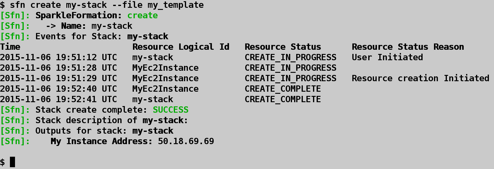
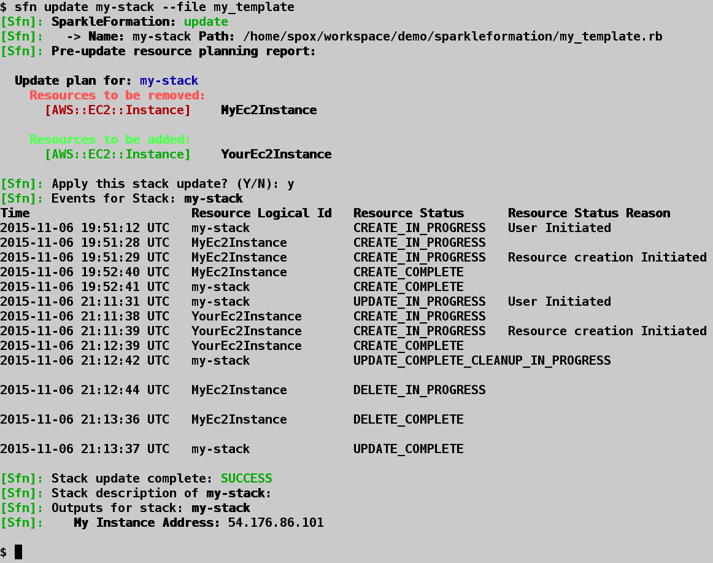
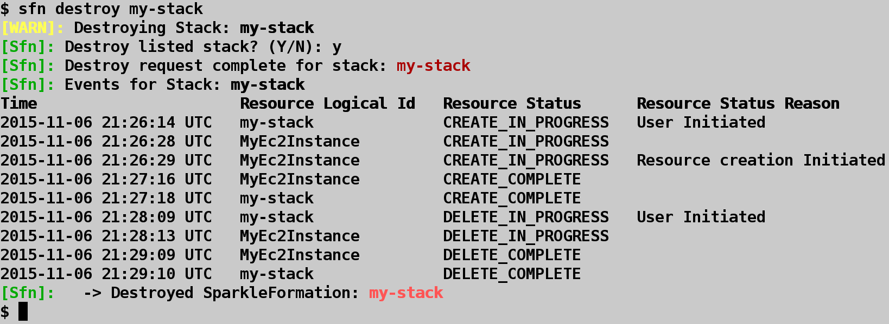
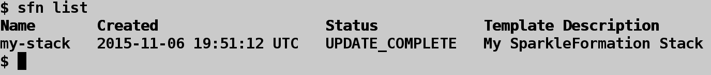
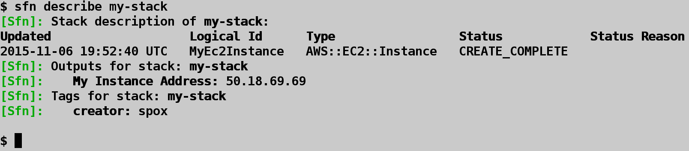
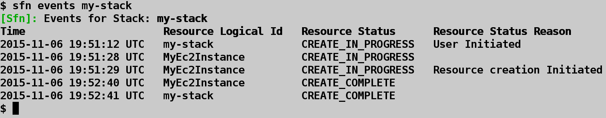
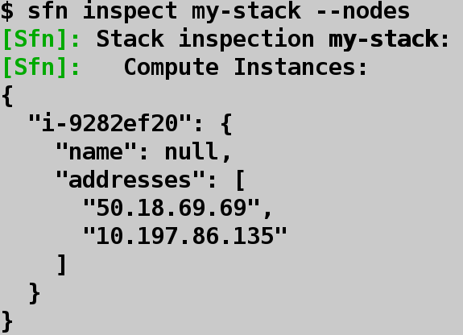
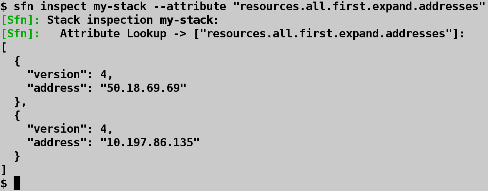
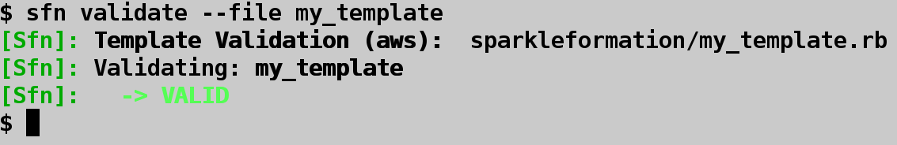
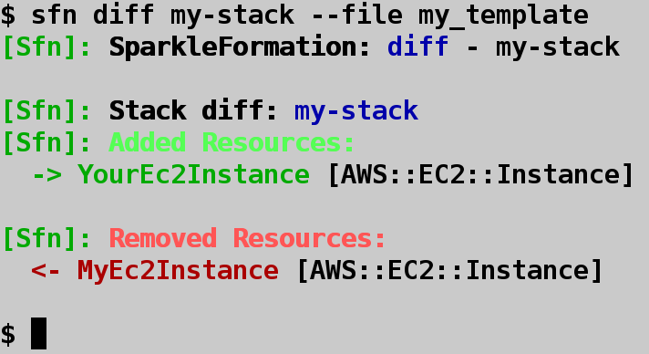

## SparkleFormation CLI commands

The `sfn` command provides a collection of subcommands to handle stack
lifecycles as well as subcommands to aid in inspection of existing
stacks.

### Lifecycle commands

#### Stack create

Stacks can be created via `sfn` using SparkleFormation templates or raw JSON
templates.

~~~
$ sfn create my-stack
~~~

`sfn` will prompt for selection of a template to build for this new stack. To
disable this prompting behavior, you can provide the path or name of the desired
template:

~~~
$ sfn create my-stack --file my_template
~~~

By default `sfn` will process and build SparkleFormation templates. To build a JSON
template, disable processing in the configuration file, or via flag:

~~~
$ sfn create my-stack --file ./my_template.json --no-processing
~~~

The `create` command is only responsible for initiating the stack creation with the
remote provider API. This does not report back the success or failure of the actual
stack creation. To provide this behavior, the `create` command will automatically poll
the stack's resource events. Once the stack as reached a completed state, the `create`
command can properly notify of a _success_ or _failed_ state and exit with the proper
status code. The automatic polling behavior can be disabled:

~~~
$ sfn create my-stack --file my_template --no-poll
~~~

The `--apply-stack` option allows providing the name of an existing
stack when creating or updating. Applying stacks is simply fetching
the outputs from the applied stacks and automatically defaulting the
set parameter of the new or updated stack. Outputs are matched
by name to the parameters of the target stack. This allows an easy
way to use values from existing stacks when building new stacks.

Example:

StackA:

~~~json
...
  "Outputs": {
    "LoadBalancerAddress": {
      "Description": "Address of Load Balancer",
      "Value": {
        "Fn::GetAtt": [
          "LoadBalancerResource",
          "DNSName"
        ]
      }
    }
  }
...
~~~

StackB:

~~~json
...
  "Parameters": {
    "LoadBalancerAddress": {
      "Type": "String",
      "Default": "unset"
    }
  }
...
~~~

When creating StackB, if we use the `--apply-stack` option:

~~~
$ sfn create StackB --apply-stack StackA
~~~

when prompted for the stack parameters, we will find the parameter
value for `LoadBalancerAddress` to be filled in with the output
provided from StackA.

Example of stack creation:

#### Stack update

Existing stacks can be updated via `sfn`:

~~~
$ sfn update my-stack
~~~

This will start an "in place" update. Only the parameters of the stack are updated. To
update the template of the stack as well:

~~~
$ sfn update my-stack --file my_template
~~~

The `update` command behaves like the `create` command. It is only responsible for initiating
the request with the remote provider API. It will poll the stack events to detect final stack
state. The polling can be disabled:

~~~
$ sfn update my-stack --file my_template --no-poll
~~~

Example of stack update:

#### Stack destroy

Existing stacks can be destroyed via `sfn`:

~~~
$ sfn destroy my-stack
~~~

By default a confirmation prompt will be provided prior to destroying an existing stack.
This can be disabled by automatically confirming:

~~~
$ sfn destroy my-stack --yes
~~~

The `destroy` command will poll the stack resource events until the stack has been successfully
deleted, or has reached a "complete" state (which would indicate a failure to destroy). The polling
can be disabled:

~~~
$ sfn destroy my-stack --yes --no-poll
~~~

The `destroy` command also provides glob support when specifying stack names. This can make cleanup
very easy when multiple testing stacks may exist:

~~~
$ sfn destroy my-stack-*
~~~

This will destroy all stacks whose name start with `my-stack-`. The command will prompt for confirmation
and provide a list of all matching stacks prior to destruction.

Example of stack destroy:

### Inspection and Information commands

#### Stack list

To list existing stacks:

~~~
$ sfn list
~~~

Example of a stack list:

#### Stack describe

A description of an existing stack will display resources allocated to the stack and any outputs
that were defined within the stack's template:

~~~
$ sfn describe my-stack
~~~

If the stack contains nested stacks, it will display the resources and outputs for those stacks
as well.

To describe only resources:

~~~
$ sfn describe my-stack --resources
~~~

To describe only outputs:

~~~
$ sfn describe my-stack --outputs
~~~

Example of a stack describe:

#### Stack events

List the events genereted by the resources allocated to an existing stack:

~~~
$ sfn events my-stack
~~~

If the resources within the stack are currently being modified (via a `create`, `update`, or `destroy`)
command, the events can be polled until the stack reaches a completed state:

~~~
$ sfn events my-stack --poll
~~~

Example of stack events:

#### Stack inspection

Existing stacks can have their resources inspected via `sfn` using the miasma model API. The `inspect`
command provides the ability to directly access resource information where the miasma library has
modeling support enabled.

One builtin helper for the `inspect` command is listing all compute resources available within a stack.
This includes standalone compute instances as well as compute instances attached to auto-scaling groups
defined within the stack.

~~~
$ sfn inspect my-stack --nodes
~~~

Example of stack node inspection:

When run with no options, the `inspect` command will output the data model information of the stack:

~~~
$ sfn inspect my-stack
~~~

Individual items can be displayed using the attribute flag:

~~~
$ sfn inspect my-stack --attribute template
~~~

The attribute flag is gets applied to the miasma data model and will output the result of request. For
example, if the stack consisted of one resource, and that resource was a compute instance, we could view
the resource information from the orchestration API point of view:

~~~
$ sfn inspect my-stack --attribute "resources.all.first"
~~~

The information here will be sparse because the orchestration API only keeps a reference to the actual
resource within its own system. Because the miasma library has compute modeling defined, we can utilize
the library to automatically load the compute instance:

~~~
$ sfn inspect my-stack --attribute "resources.all.first.expand"
~~~

If only the addresses allocated to the compute instance were desired, that can be requested:

~~~
$ sfn inspect my-stack --attribute "resources.all.first.expand.addresses"
~~~

Example of stack attribute inspection

#### Template print

To display a generated template:

~~~
$ sfn print --file my_template
~~~

#### Template validation

Templates can be validated with the remote provide API prior to creation:

~~~
$ sfn validate --file my_template
~~~

If the template is a JSON style template, disable processing:

~~~
$ sfn validate --file my_template --no-processing
~~~

Example of stack validate:

#### Template diff

Template updates can be diff'ed against an existing stack's template to display information about
what resource modifications will be introduced by the new template:

~~~
$ sfn diff my-stack --file my_template
~~~

Example of stack diff:

### Configuration commands

To aid setup and configuration, `sfn` provides a configuration helper:

~~~
$ sfn conf
~~~

This will display the current configuration. If no configuration file is present, the user can have
one automatically generated for them:

~~~
$ sfn conf --generate
~~~